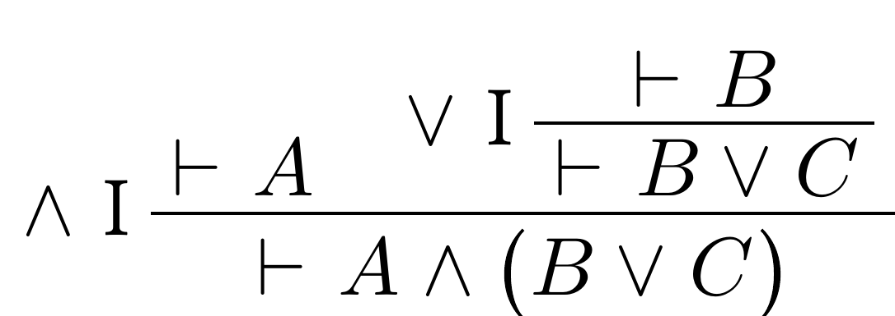

# satysfi-derive


SATySFi commands and DSL for displaying derivation trees with maintainable code.

```ml
@require: math
@require: base/typeset/satysfi-it
@require: derive/derive

open Derive in
satysfi-it ${
  \proven!(
    open DeriveDSL in
    derive ${ \vdash A \wedge \paren {B \vee C} }
    |> by {${\wedge} I}
    |> from [
        assume ${\vdash A};
        derive ${\vdash B \vee C}
        |> by {${\vee} I}
        |> from [
          assume ${\vdash B};
        ];
    ]
  )
}
```
will render the following pdf:



## Why satysfi-derive?
* Intuitive and readable DSL.
* Customizable typesetting configuration.
* Well maintaned codebase with regression tests.

## How to install
⚠ satysfi-derive is not published yet.
```
$ opam install satysfi-derive
$ satyrographos install -l derive
```

Then you can use satysfi-derive by `@require derive/derive`.

## How to use
See [satysfi-derive crash course](doc/crash-course.md) to learn how to use satysfi-derive.

## Lisence
All files in this repository are licensed under MIT.
