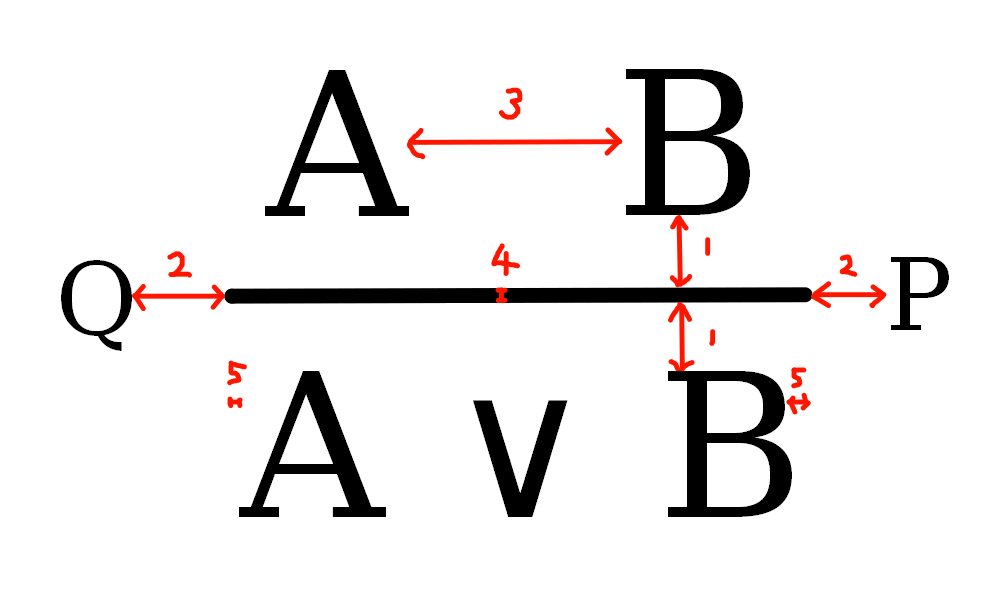

# satysfi-derive crash course
Welcome to satysfi-derive crash cource! In this course, we will explain how to write derivation trees using satysfi-derive.

To use satysfi-derive-related modules, put `@require derive/derive` at the top of the file.

```
% math mode
\proven!(derivation)
```

(`!(...)` is the syntax for switching from math mode to program mode)

Here, the argument `derivation` is a value of type `DerivationAst.t` that represents the content of the derivation tree. The `DeriveDSL` module provides a DSL for constructing `DerivationAst.t` values. The functions provided by `DeriveDSL` are as follows:

* `derive`
* `from`
* `assume`
* `by`
* `byOp`
* `withLine`

## Initiate a derivation
`derive` is the most basic construct. `derive ${math}` constructs a derivation tree with empty premises and `${math}` for the conclusion. Basically, when you build a derivation tree, you should start with derive.

```ml
derive ${A \wedge B}
```


## Set assumptions
`derivation |> from [derivation1; derivation2; ...]` sets the assumptions of `derivation` to the derivation trees that correspond to `derivation1`, `derivation2`... .

```ml
derive ${A \wedge B}
|> from [
  derive ${A};
  derive ${B};
]
```


## Construct an assumption
`assume` is a variant of `derive`. `assume` does not display a line whereas `derive` does. If a derivation tree is hypothetical, it is more appropriate to use `assume`.

```ml:assumeの使用例
derive ${A \wedge B}
|> from [
  assume ${A};
  assume ${B};
]
```


## Setting a label
`derivation |> by {DeriveDSL.label}` sets a label of `derivation`.

```ml
derive ${A \wedge B}
|> by {${\wedge}-intro}
|> from [
  assume ${A};
  assume ${B};
]
```


`derivation |> byOp {label}` also sets the label of the derivation tree, but the location of the label is opposite to `by`.

```ml
derive ${A \wedge B}
|> by {${\wedge}-intro}
|> byOp {(1)}
|> from [
  assume ${A};
  assume ${B};
]
```


## Change line
`derivation |> withLine line` explicitly sets how the derivation line will be drawn. You can use values of type `DeriveLine.t` for `line`. The following lines are available in `DeriveDSL`.

* `standard-line`: solid line
* `no-line`: no line
* `dotted-line dot-len spacing`: dotted line where dot length is `dot-len` and spacing is `spacing`

Since `standard-line` and `no-line` are used by default in `derive` and `assume`, respectively, you want to use `withLine` only when you use `dotted-line`. If you want to define other lines on your own, consider using `DeriveLine.make` ([source code](https://github.com/yabaitechtokyo/satysfi-derive/blob/main/src/line.satyh#L8-L11)).


```ml
derive ${A \wedge B}
|> withLine (dotted-line 2pt 1pt)
```


## Adjust the layout
Using the `DeriveConfig` module ([source code](https://github.com/yabaitechtokyo/satysfi-derive/blob/main/src/config.satyh)), you can adjust the layout in detail. Specifically, the following properties can be adjusted.

* main-label-position: The default side of lable put by `by`.
* default-line: The default line used by `derive`.
* line-vertical-margin: 1 in the figure below. The vertical margin of a line.
* line-horizontal-margin: 2 in the figure below. The horizontal margin of a line.
* assumption-spacing: 3 in the figure below. The spacing between assumptions.
* line-thickness: 4 in the figure below. The thickness of a line.
* content-padding: 5 in the figure below. The padding of a conclusion and assumptions, which affects the length of a line.



That is pretty much the crash cource. Enjoy life with SATySFi!
